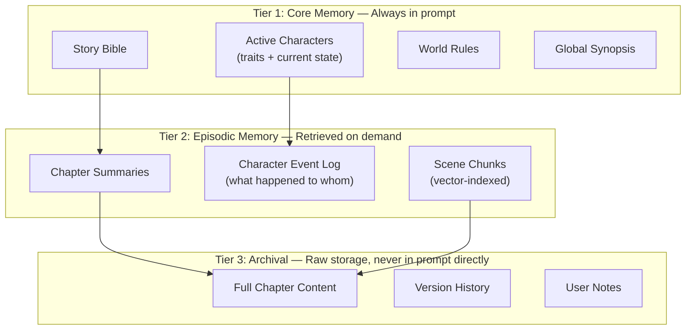
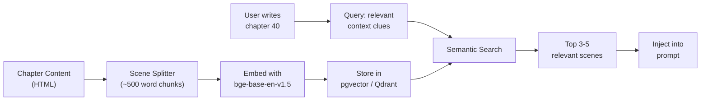

# Long Story Context Architecture for Contextra

How tools like Sudowrite handle 100K+ word novels with LLMs that have finite context windows — and how to build the same thing with **Qwen3 14B** (~32K context).

---

## Part 1: How Sudowrite Actually Works

> [!IMPORTANT]
> **The model never sees your full novel.** Every LLM call is stateless — zero memory between requests. The illusion of long-term story awareness comes from **architecture, not model size**.

### The Core Trick: Context Engineering

```
┌─────────────────────────────────────────────────┐
│           User writes / requests AI help         │
└─────────────────┬───────────────────────────────┘
                  ▼
┌─────────────────────────────────────────────────┐
│            Context Assembly Engine                │
│                                                   │
│  1. What is the user doing right now?             │
│  2. What does the model NEED to know?             │
│  3. What can I FIT in the context window?         │
│  4. What is most IMPORTANT (priority ranking)?    │
└─────────────────┬───────────────────────────────┘
                  ▼
┌─────────────────────────────────────────────────┐
│  Assembled Prompt (fits in context window)        │
│                                                   │
│  • Story Bible excerpt (characters, world rules)  │
│  • Compressed summaries of relevant chapters      │
│  • Last ~2K words of raw prose (immediate context)│
│  • Task instructions                              │
└─────────────────┬───────────────────────────────┘
                  ▼
            LLM generates
```

### What Sudowrite Stores (5 Layers)

| Layer | What | How It's Used |
|-------|------|---------------|
| **Story Bible** | Characters, world rules, themes, genre, synopsis | Injected into every prompt as "permanent context" |
| **Chapter Outlines** | Beat-by-beat plan for each chapter | Keeps generation on-plot |
| **Chapter Summaries** | Auto-generated after each chapter is written | Gives the model "memory" of what happened |
| **Recent Prose** | Last ~5,000-20,000 words of raw text | Maintains immediate voice/tone continuity |
| **Scene Beats** | User-defined or AI-generated structure for current scene | Constrains the current generation |

The key insight: **the model sees ~8-15K tokens per request**, assembled dynamically from these layers based on what's relevant to the current writing task.

---

## Part 2: Your Current Gaps

Looking at your Contextra codebase:

### What You Have ✅

| Component | File | Status |
|-----------|------|--------|
| Project metadata (genre, tone, audience) | `Project` model | ✅ Working |
| Character cards (name, role, memory, traits) | `Character` model | ✅ Working |
| World rules | `Project.worldRules` | ✅ Working |
| Chapter content + summaries | `Chapter` model | ✅ Working |
| Branch-aware continuity | [contextService.ts](file:///home/dwyn/Documents/Web/Contextra/src/services/contextService.ts) | ✅ Working |
| Context assembly for prompts | [aiService.ts](file:///home/dwyn/Documents/Web/Contextra/src/services/aiService.ts) | ✅ Basic |

### What's Missing ❌

| Component | Why You Need It | Severity |
|-----------|----------------|----------|
| **Auto chapter summarization** | `getChapterMemory()` falls back to a 280-char excerpt. At 50 chapters, this is unusable | 🔴 Critical |
| **Character state tracking** | `Character.memory` is a static string. Characters evolve chapter-to-chapter | 🔴 Critical |
| **Token budgeting** | `buildPrompt()` dumps ALL characters + last 5 chapters. At 50 chars + 100 chapters → blows past 32K | 🔴 Critical |
| **Semantic search (RAG)** | No way to find "the scene where Alice betrayed Bob" from chapter 12 when writing chapter 40 | 🟡 High |
| **Hierarchical memory** | No distinction between "critical facts" vs "nice-to-have" context | 🟡 High |
| **Scene-level chunking** | Chapters stored as one HTML blob. Can't retrieve specific scenes | 🟡 Medium |

---

## Part 3: The Architecture to Build

### 3-Tier Memory Hierarchy

This is the core pattern used by every serious AI writing tool:



### Token Budget Model

With Qwen3 14B at ~32K tokens, your **usable budget** is:

```
Total context window:     32,000 tokens
─ System prompt:            ~500 tokens
─ Output reservation:     ~4,000 tokens (generated prose)
─ Safety margin:          ~1,500 tokens
═══════════════════════════════════════
Available for context:   ~26,000 tokens
```

How to **spend** it:

| Budget Slice | Tokens | What Goes In |
|-------------|--------|--------------|
| **Story Bible** | ~2,000 | Genre, tone, synopsis, world rules |
| **Active Characters** | ~3,000 | Only characters in this scene (compressed) |
| **Plot Continuity** | ~4,000 | Summaries of last 5-10 chapters |
| **Relevant Retrieved** | ~4,000 | Semantically similar past scenes (RAG) |
| **Immediate Context** | ~8,000 | Last 2-3K words of raw prose |
| **Task Instructions** | ~2,000 | User prompt + chapter outline |
| **Buffer** | ~3,000 | Overflow / flexibility |

---

## Part 4: Components to Build

### Component 1: Auto-Summarization Pipeline

**What**: Auto-generate structured summaries on chapter save.

**Why**: Your `getChapterMemory()` falls back to 280-char excerpts. That's not enough for long-term memory.

**Flow**:
```
Chapter saved/updated
        ↓
Qwen3 summarizes (background job)
        ↓
Store structured summary
        ↓
Extract: key events, character changes, new facts
        ↓
Store in ChapterSummary + CharacterEvent tables
```

**Schema addition**:

```prisma
model ChapterSummary {
  id           String   @id @default(uuid())
  chapterId    String   @unique
  summary      String   // 2-3 sentence narrative summary
  keyEvents    Json     // ["Alice betrayed Bob", "The sword was broken"]
  factsLearned Json     // ["Bob's real name is Charles"]
  characters   Json     // ["Alice", "Bob"] — who appeared
  emotional    String?  // "tense", "hopeful" — mood
  createdAt    DateTime @default(now())
  updatedAt    DateTime @updatedAt

  chapter      Chapter  @relation(fields: [chapterId], references: [id], onDelete: Cascade)
}
```

---

### Component 2: Character State Machine

**What**: Replace the static `Character.memory` string with an event log tracking evolution.

**Why**: By chapter 30, "Alice is friendly and kind" is wrong when she betrayed everyone in chapter 15.

**Schema addition**:

```prisma
model CharacterEvent {
  id          String   @id @default(uuid())
  characterId String
  chapterId   String
  eventType   String   // "trait_change", "relationship", "knowledge", "status"
  description String   // "Alice learned Bob's secret identity"
  importance  Int      @default(5) // 1-10 scale
  createdAt   DateTime @default(now())

  character   Character @relation(fields: [characterId], references: [id], onDelete: Cascade)
  chapter     Chapter   @relation(fields: [chapterId], references: [id], onDelete: Cascade)
}
```

**Reconstruction logic**:

```typescript
function buildCharacterState(character: Character, events: CharacterEvent[]) {
  // Base traits from Character card
  let state = `${character.name} (${character.role}): ${character.memory}\n`;
  state += `Traits: ${character.traits.join(', ')}\n`;

  // Layer on important recent events (most recent first)
  const recentEvents = events
    .filter(e => e.importance >= 7)
    .slice(-10)
    .map(e => `- [Ch${e.chapterIndex}] ${e.description}`)
    .join('\n');

  if (recentEvents) {
    state += `Recent developments:\n${recentEvents}`;
  }
  return state;
}
```

---

### Component 3: Smart Context Assembler

**What**: Replace `buildPrompt()` with a budget-aware context engine.

**Why**: Your current impl dumps everything. At scale, it exceeds 32K tokens.

**Replace** [buildPrompt()](file:///home/dwyn/Documents/Web/Contextra/src/services/aiService.ts#L73-L113) **with**:

```typescript
interface ContextBudget {
  totalTokens: number;       // 26000 for Qwen3 14B
  storyBible: number;        // ~2000
  characters: number;        // ~3000
  continuity: number;        // ~4000
  retrieved: number;         // ~4000
  immediateContext: number;  // ~8000
  instructions: number;      // ~2000
  buffer: number;            // ~3000
}

async function assembleContext(
  projectId: string,
  branchId: string,
  currentChapterIndex: number,
  userInstructions: string,
  budget: ContextBudget
): Promise<string> {
  // 1. Story Bible (always included, compressed to budget)
  const bible = await getStoryBible(projectId);
  const bibleText = compressToTokenBudget(bible, budget.storyBible);

  // 2. Only RELEVANT characters (not all 50)
  const mentionedChars = extractMentionedCharacters(userInstructions);
  const recentChars = await getCharactersFromRecentChapters(projectId, branchId, 3);
  const relevantChars = [...new Set([...mentionedChars, ...recentChars])];
  const charText = await buildCharacterStates(relevantChars, budget.characters);

  // 3. Hierarchical summaries (pyramid structure)
  const summaries = await getHierarchicalSummaries(projectId, branchId, currentChapterIndex);
  const continuityText = compressToTokenBudget(summaries, budget.continuity);

  // 4. RAG retrieval (semantically similar past scenes)
  const retrieved = await semanticSearch(userInstructions, projectId, branchId, 5);
  const retrievedText = compressToTokenBudget(retrieved, budget.retrieved);

  // 5. Immediate context (last N words of raw prose)
  const recentProse = await getRecentProse(projectId, branchId, currentChapterIndex);
  const proseText = truncateToTokenBudget(recentProse, budget.immediateContext);

  return assembleFinalPrompt({ bible: bibleText, characters: charText,
    continuity: continuityText, retrieved: retrievedText,
    recentProse: proseText, instructions: userInstructions });
}
```

---

### Component 4: Hierarchical Summarization (Arc Summaries)

**What**: Build a pyramid of progressively compressed summaries instead of flat chapter lists.

**Why**: At chapter 50, you need both "the overall arc" AND "what happened recently". Flat lists can't do both within budget.

**The pyramid pattern**:

```
Chapters  1-10  →  Arc Summary A    (200 tokens)
Chapters 11-20  →  Arc Summary B    (200 tokens)
Chapters 21-30  →  Arc Summary C    (200 tokens)
Chapters 31-40  →  Arc Summary D    (200 tokens)
Chapter   41    →  Full summary     (300 tokens)
Chapter   42    →  Full summary     (300 tokens)
Chapter   43    →  Full summary     (300 tokens)
Chapters 44-45  →  Raw prose        (2000 tokens)
                                    ─────────────
                    Total:           ~3,500 tokens
```

This gives you **coverage of the entire novel in ~4K tokens**.

**Schema addition**:

```prisma
model ArcSummary {
  id            String   @id @default(uuid())
  projectId     String
  branchId      String
  startChapter  Int
  endChapter    Int
  summary       String   // Compressed summary of this arc
  keyCharacters Json     // Characters involved
  majorEvents   Json     // Critical plot points
  createdAt     DateTime @default(now())
  updatedAt     DateTime @updatedAt

  project       Project  @relation(fields: [projectId], references: [id], onDelete: Cascade)
}
```

---

### Component 5: Vector Search (RAG)

**What**: Embed chapter scenes into vectors, search semantically when building context.

**Why**: When writing "Alice confronts Bob about the betrayal", keyword search can't find the actual betrayal scene from chapter 12. Semantic search can.

**Architecture**:



**Vector DB options**:

| Option | Pros | Cons |
|--------|------|------|
| **pgvector** | No new infra, you already run Postgres | Slightly slower at scale |
| **Qdrant** | Fast, purpose-built, good filtering | Extra container to manage |

> [!TIP]
> For a project at your scale, **pgvector is recommended**. It keeps your stack simple — no extra containers. You only need Qdrant if you're handling 1000+ chapters across many projects.

**Embedding options (local)**:

| Model | Dimensions | Speed | Quality |
|-------|-----------|-------|---------|
| `BAAI/bge-base-en-v1.5` | 768 | Good | Great for fiction |
| `nomic-embed-text-v1.5` | 768 | Good | Newer, also great |
| `all-MiniLM-L6-v2` | 384 | Fastest | Decent, smaller vectors |

You can run embeddings in Node.js with `@xenova/transformers` (no Python sidecar needed).

---

## Part 5: Build Roadmap (Priority Order)

### Phase 1: Auto-Summarization 🔴
> **Impact**: Immediate improvement to context quality  
> **Effort**: ~1-2 days

- Add `ChapterSummary` model to Prisma schema
- Create background summarization service using Qwen3
- Auto-trigger on chapter save/update
- Update `contextService.ts` to use auto-summaries instead of 280-char excerpts

### Phase 2: Smart Context Budgeting 🔴
> **Impact**: Prevents context overflow as stories grow  
> **Effort**: ~1 day

- Add token counting utility (use `tiktoken` or `~4 chars ≈ 1 token` estimation)
- Rewrite `buildPrompt()` with budget allocation
- Add "relevant characters only" filtering
- Implement hierarchical summary selection

### Phase 3: Character State Tracking 🟡
> **Impact**: Characters stay consistent across long stories  
> **Effort**: ~2 days

- Add `CharacterEvent` model to Prisma schema
- Extract character events during summarization pipeline
- Build character state reconstruction function
- Update context assembly to use dynamic character states

### Phase 4: Hierarchical Summaries 🟡
> **Impact**: Full-novel awareness even at chapter 100+  
> **Effort**: ~2 days

- Add `ArcSummary` model
- Build arc summarization pipeline (group chapters → summarize group)
- Update context assembly to use pyramid structure
- Optional: add UI for manual arc management

### Phase 5: Vector Search (RAG) 🟢
> **Impact**: Find specific past scenes semantically  
> **Effort**: ~3-4 days

- Add pgvector extension to PostgreSQL
- Build scene chunker (split chapters into ~500-word scenes)
- Set up local embedding generation with `@xenova/transformers`
- Build semantic search endpoint
- Integrate retrieved scenes into context assembly

---

## Part 6: Quick Wins (No New Infrastructure)

These changes can be made to your existing code **today**:

### 1. Filter characters by relevance

In [contextService.ts](file:///home/dwyn/Documents/Web/Contextra/src/services/contextService.ts#L37-L41):

```typescript
// BEFORE: dumps ALL characters
const characterDigest = project.characters
  .map(c => `${c.name} (${c.role}) | Memory: ${c.memory}`)
  .join("\n");

// AFTER: only characters mentioned in instructions or recent chapters
const recentContent = lineage.slice(-3).map(c => c.content).join(" ");
const relevantCharacters = project.characters.filter(c =>
  input.instructions?.toLowerCase().includes(c.name.toLowerCase()) ||
  recentContent.toLowerCase().includes(c.name.toLowerCase())
);
```

### 2. Use sliding window for chapter history

```typescript
// BEFORE: last 5 chapters, same detail level
const recentChapters = lineage.slice(-5).map(c => `${c.title}: ${getChapterMemory(c)}`);

// AFTER: pyramid — full detail recent, condensed older
const fullDetail = lineage.slice(-2).map(c => `${c.title}: ${getChapterMemory(c)}`);
const condensed = lineage.slice(-8, -2).map(c => `${c.title}: ${c.summary?.slice(0, 100) || "..."}`);
const recentChapters = [...condensed, ...fullDetail];
```

### 3. Add "previously on..." running summary

After each chapter generation, ask Qwen3 to update a single paragraph "story so far" summary. Store it on the `Project` model. This single field gives the model a ~200 token overview of the entire novel.

---

## Part 7: Comparison — Your Stack vs Sudowrite

| Capability | Sudowrite | Your Current Stack | After Building This |
|-----------|-----------|-------------------|---------------------|
| Story Bible | ✅ Full | ✅ Basic | ✅ Full |
| Character tracking | ✅ Evolving profiles | ⚠️ Static `memory` field | ✅ Event-based |
| Chapter summaries | ✅ Auto-generated | ⚠️ Manual / 280-char fallback | ✅ Auto-generated |
| Semantic search | ✅ Yes | ❌ None | ✅ pgvector |
| Context budgeting | ✅ Smart | ❌ Dump everything | ✅ Token-aware |
| Hierarchical memory | ✅ Yes | ❌ Flat list | ✅ 3-tier pyramid |
| Multi-model routing | ✅ GPT-5 / Claude / custom | ⚠️ Single Qwen3 | ⚠️ Single Qwen3 |
| Model quality | ✅ Frontier models | ⚠️ 14B local | ⚠️ 14B local |

> [!NOTE]
> **You can't match Sudowrite's raw model quality** — they use frontier models. But you CAN match their architecture. And good architecture with a smaller model **beats** a big model with bad architecture every time. A well-curated 8K prompt to Qwen3 14B will produce better results than dumping 100K tokens of unfiltered text into GPT-4o.

---

## Decision Points for You

1. **Which phases to build first?** I recommend Phase 1-2 (auto-summarization + budgeting) — they're the highest-impact changes with the least effort.

2. **Vector DB**: pgvector (stays in Postgres, simpler) or Qdrant (faster, separate container)?

3. **Embedding runtime**: Node.js via `@xenova/transformers` (no new service) or Python sidecar (more mature)?

4. **Summarization trigger**: Synchronous (user waits ~5s) or background job (async, better UX but needs job queue)?

5. **Want to start implementing?** If so, which phase first?
